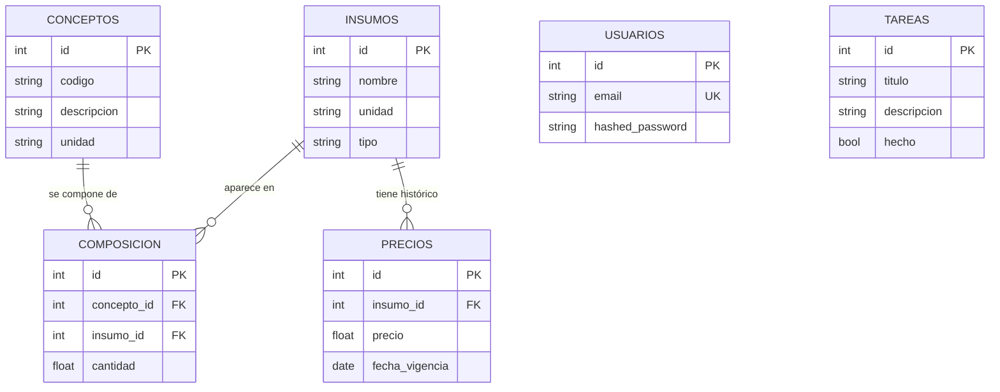

# API de Costos de Construcción (APU)

API REST para cálculo de costos de construcción (APU) con precios históricos.

**Demo en vivo:** https://backend-7p18.onrender.com/docs

> La primera carga puede tardar ~1 minuto: es el arranque en frío del plan gratuito de Render.

## SOURCE

Datos que alimentan el sistema:

- **Catálogo de insumos** — block, arena, cal (precios Cruz Azul 2024) con unidad y tipo.
- **Precios históricos** — cada precio lleva su fecha de vigencia; permite costear "a fecha".
- **Composiciones** — recetas que ligan cada concepto con sus insumos y cantidades.
- **Usuarios** — registro/login para proteger la escritura con JWT.

## SYSTEM

Flujo de punta a punta:

```
Insumos + Precios históricos  →  Composiciones  →  Cálculo de costo por concepto a fecha dada
```

1. Se cargan insumos y sus precios con fecha de vigencia (escritura protegida).
2. Se definen conceptos de obra y su composición (receta de insumos + cantidades).
3. El endpoint `/conceptos/{id}/costo?fecha=YYYY-MM-DD` calcula el costo total usando el precio vigente más reciente <= fecha para cada insumo.
4. Lectura pública; escritura requiere autenticación JWT.

## ENGINEERING

Stack y decisiones concretas:

- **FastAPI + Pydantic**: validación automática de inputs, documentación interactiva en `/docs`.
- **SQLAlchemy ORM + PostgreSQL (Supabase)**: modelo relacional con 6 tablas, migraciones implícitas vía `Base.metadata.create_all`.
- **Estabilidad en producción**: `pool_pre_ping=True` + `pool_recycle=300` en el engine para evitar "server closed the connection" en Render.
- **Auth JWT (OAuth2 + bcrypt==4.3.0)**: login con form-data, token Bearer. Escritura protegida; lectura pública.
- **Manejador global de errores**: `@app.exception_handler(Exception)` devuelve 500 genérico sin exponer tracebacks al cliente.
- **Sync endpoints**: `def` a propósito; async es tema futuro del plan de aprendizaje.

## ROLE

Proyecto personal de portafolio. Diseñé el modelo de datos, construí todos los endpoints, implementé la lógica de cálculo con precios históricos y desplegué a Render. El dominio real de construcción (precios Cruz Azul 2024) es el diferenciador frente a un CRUD genérico.

## Endpoints

| Método | Ruta | Descripción | Auth |
|--------|------|-------------|------|
| POST | `/registro` | Crea usuario | Público |
| POST | `/login` | Obtiene token JWT (form-data) | Público |
| POST | `/insumos` | Crea insumo | 🔒 |
| GET | `/insumos` | Lista insumos | Público |
| PUT | `/insumos/{id}` | Actualiza insumo | 🔒 |
| DELETE | `/insumos/{id}` | Elimina insumo | 🔒 |
| POST | `/precios` | Carga precio histórico | 🔒 |
| GET | `/precios` | Lista precios | Público |
| POST | `/conceptos` | Crea concepto | 🔒 |
| GET | `/conceptos` | Lista conceptos | Público |
| PUT | `/conceptos/{id}` | Actualiza concepto | 🔒 |
| DELETE | `/conceptos/{id}` | Elimina concepto | 🔒 |
| POST | `/composicion` | Crea receta | 🔒 |
| GET | `/composicion` | Lista composiciones | Público |
| GET | `/conceptos/{id}/costo?fecha=YYYY-MM-DD` | Calcula costo a fecha | Público |
| POST | `/tareas` | CRUD de práctica | Público |
| GET | `/tareas` | CRUD de práctica | Público |
| PUT | `/tareas/{id}` | CRUD de práctica | Público |
| DELETE | `/tareas/{id}` | CRUD de práctica | Público |

> 🔒 Requiere token Bearer en header `Authorization`.

## Modelo de datos



`composicion` es la tabla puente (receta): liga cada concepto con sus insumos y cantidades. `precios` guarda el histórico por insumo con `fecha_vigencia`. `tareas` es el CRUD de práctica de Fase 1, fuera del núcleo APU.

## Cómo correr localmente

1. Clonar el repositorio
2. Crear entorno virtual: `python -m venv venv`
3. Activar: `venv\Scripts\activate`
4. Instalar dependencias: `pip install -r requirements.txt`
5. Crear `.env` con:
   ```
   DATABASE_URL=postgresql://...
   SECRET_KEY=tu_clave_secreta
   ```
6. Arrancar: `fastapi dev main.py` → docs en `http://localhost:8000/docs`

## Notas

- Los endpoints de `/tareas` son un CRUD de práctica de Fase 1; no forman parte del núcleo APU.
- Los rendimientos mostrados en el cálculo de costos son ejemplos educativos, no verificados en campo.
- La API usa fechas ISO (`YYYY-MM-DD`) para consultar precios históricos.
